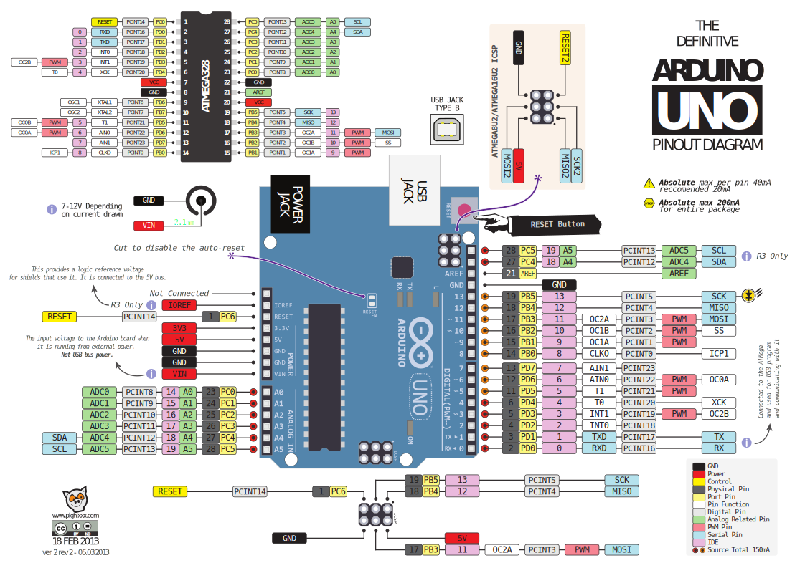

### Common boards
* Arduino Uno / Nano / Pro Mini
* Pin Comments:
  * RAW: Unregulated voltage input (up to 12V?). If the board is powered via USB, the voltage at this pin will be about 4.8V.
  * VCC: Regulated voltage input (MUST be 5V or 3.3V). If the board is powered via USB or RAW, the voltage can supplies other devices.  
  * RST: Pulled up. Connecting to the ground initiates a reset. The board will remain "off" until the reset line is pulled back to high.
### Get Started
* [<b>Windows</b> Only] Install a USB-to-UART bridge driver.
   * PC (Windows) supports USB communication protocol but Arduino board does not. 
   * Instead, Arduino supports UART communication. 
   * There should be a USB-to-UART Bridge between PC and Arduino.
     * Uno / Nano has on-board bridge chip while Pro Mini does not
     * The bridge chip varies by board. (My Uno / Nano clones has CH341. I cannot guarantee for the genuine Arduino)
   * Install the bridge chip driver on PC, which creates a Virtual COM port (VCP) for communication.
     * Uno / Nano: Use this [CH341 driver](driver/CH341SER.EXE) 
     * Pro Mini: Look down for a dedicated section
   * Check Windows Device Manager and see the new COM port 
     </br> </img> 
* Install Arduino IDE
* Choose the right board in IDE
  * There is a set of parameters for each arduino board, choosing the right one is the key. 
  </br> </img> 
* Try a blink test of on-board LED
  * File -> Examples -> 01.Basics -> Blink 
  * Sketch -> Upload
### Pro Mini
* Pro Mini is the smallest Arduino board 
* Bought an adapter, which has a FTDI-made FT232RL bridge chip.
* use this [FT232RL driver](driver/CDM%20v2.12.28%20WHQL%20Certified.zip) or download from [FTDI](https://www.ftdichip.com/Drivers/VCP.htm).
* Use <b>Windows Device Manager</b> to install the driver manually. 
* To connect the adapter and Arduino Pro Mini, GND, VCC, RX, TX, and DTR (Data Terminal Ready) should be all connected. 
### Pro Micro
* ATmega32u4
### Pinout
* We need a pinout map to find special GPIO pins on each board
* For example, I2C pins are A4/A5 on Arduino Nano
* Uno<br/></img>
* Nano
  * Vin: Accepts 6~12V unregulated external power source
  * 5V : Accepts 5V regulated power source 
  * 5V : Also, emits 5V regulated power<br/></img>
* Pro Mini
  * RAW: Accepts 6~12V unregulated external power source
  * VCC: Accepts 5V regulated power source<br/></img>
* Pro Micro
  <br/></img> 
### Analog pin and digital pin in Arduino IDE
* In Arduino IDE, use A1 to indicate an analog pin, and use 1 to indicate a digital pin
```
digitalWrite(A1, HIGH); // sets the analog pin 1 on 
digitalWrite( 1, LOW);  // sets the digital pin 1 off
``` 
### 3.3v board and 5v board
* Arduino board's GPIOs are generally 5v.
* Among Uno, Nano and Pro Mini, only Pro Mini has the 3.3v version, which means the GPIO pins operate at between 0~3.3v (voltage). 
* Some sensors (loads) need 5V voltage to power but communicates with arduino board on a 3.3v logic level
* You would risk to fry the sensor if there is a voltage mismatch 
* Use a logic level converter to step down the voltage for fragile sensor.
* BTW, [raspberry pi's GPIO pins are 3.3v](https://www.raspberrypi.org/documentation/hardware/raspberrypi/gpio/README.md). So if you want your Pi talk to arduino via uart interface, use a logic level converter as well.
### Talk to Raspberry Pi
* It is so easy by using UART protocol.
* Hook Rx/Tx pins of Arduino with Tx/Rx pins of Raspberry Pi
* On Arduino, we use Serial.print to output message
* On Raspberry Pi, use pyserial to get the message. (Don't forget enable UART interface via raspi-config)
### C++ note 
```
uint8_t = atof(String.c_str()) // Convert String to int
```
