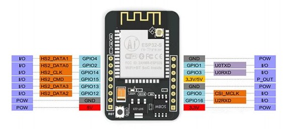

### ESP32-CAM
</img>  
1. Wiring 
* Baudrate: 115200
* Connect I/O_0 with GND to enter download mode.
* Disconnect I/O_0 with GND when using. Otherwise, the board will boot into download mode and emit "waiting for download" through Serial.
```
ESP32      FTDI 
  GND <--> GND
   5V <--> 5V
  U0R <--> TX
  U0T <--> RX
/-GND
|
\-IO0
```
2. Arduino IDE configuration
* Board Manager URL: https://dl.espressif.com/dl/package_esp32_index.json
* Board: AI Thinker ESP32-CAM
* Flash Mode: Doesn't matter
3. Test example
* Example -> ESP32 -> Camera -> CameraWebServer
* Configure mode, set ssid and password.
```
define CAMERA_MODEL_AI_THINKER // Has PSRAM
```
