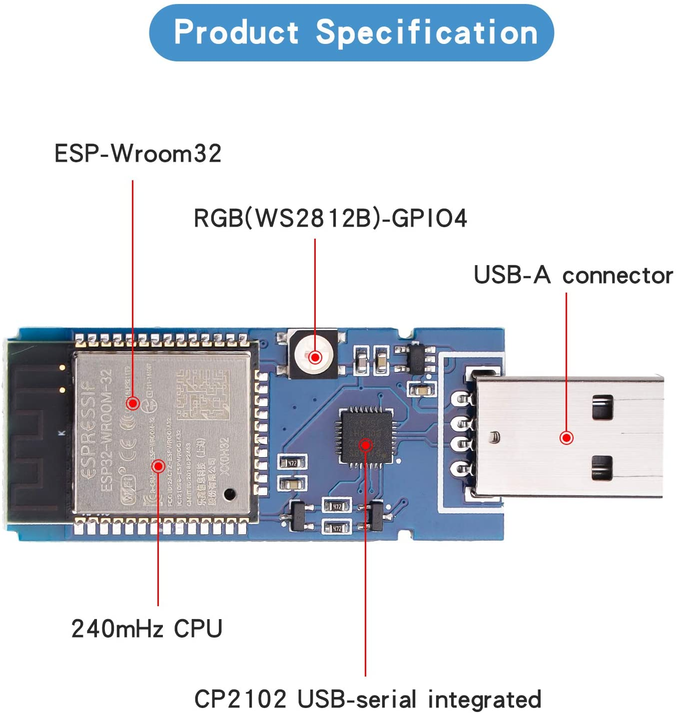

### DSTIKE USB32
* Name: ESP32 Dev Module
* FQBN: esp32:esp32:esp32
* Demo: [Light RGB LED](https://github.com/lspoplove/D-duino-project/blob/master/USB32/Democode.ino) 
* Website: https://dstike.com/products/dstike-usb32 
</img>
### Some nonsense from seller
```
Tutorial:
1. Instalar el entorno para ESP32: https://github.com/espressif/arduino-esp32?spm=a2g0o.detail.1000023.1.69c867655uu6l5
2. Instalar Adafruit NeoPixel Library: https://github.com/adafruit/Adafruit_NeoPixel?spm=a2g0o.detail.1000023.2.69c867655uu6l5
3. Seleccione la placa de desarrollo ESP32 otros parивmetros de forma predeterminada.
4. Cиоdigo de demostraciиоn: https://github.com/lspoplove/D-duino-project/blob/master/USB32/Democode.ino?spm=a2g0o.detail.1000023.3.69c867655uu6l5&file=Democode.ino

ESP32: https://www.espressif.com/es/products/socs/esp32
http://vcc-gnd.com/rtd/html/esp32/general.html
```