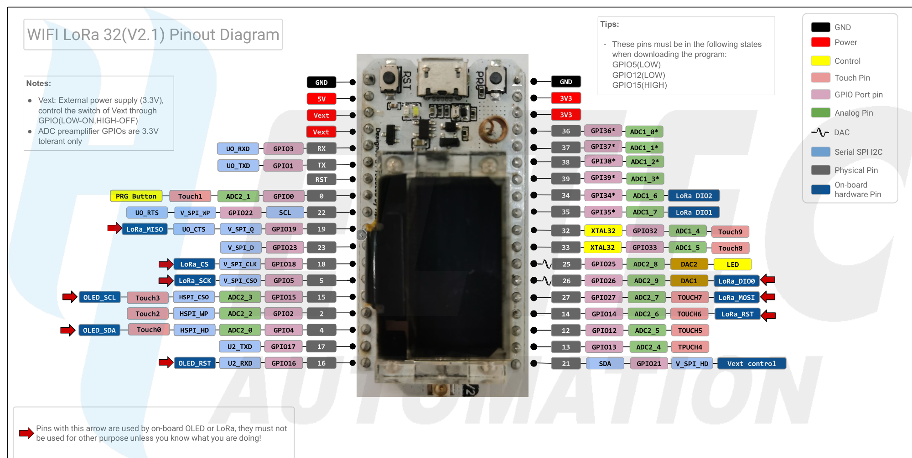

### Heltec WiFi LoRa 32 V2 
* ESP32 development board with 8 MB Flash 
  * a SemTech SX1276 for 915MHz LoRaWAN communication (SX1278 for 433MHz)   
  * a SSD1306 0.96-inch 128x64 OLED display connected via I2C.
* [Heltec_ESP32 Library](https://github.com/HelTecAutomation/Heltec_ESP32/tree/master/examples) for LoRa and OLED.
* I like to use libraries radiolib and SSD1306 directly. 
  * I made this [demo](LoRa_OLED/LoRa_OLED.ino)
  * GPIO16 should be pulled up internally to turn on OLED~ 
### Pinout
</img>
