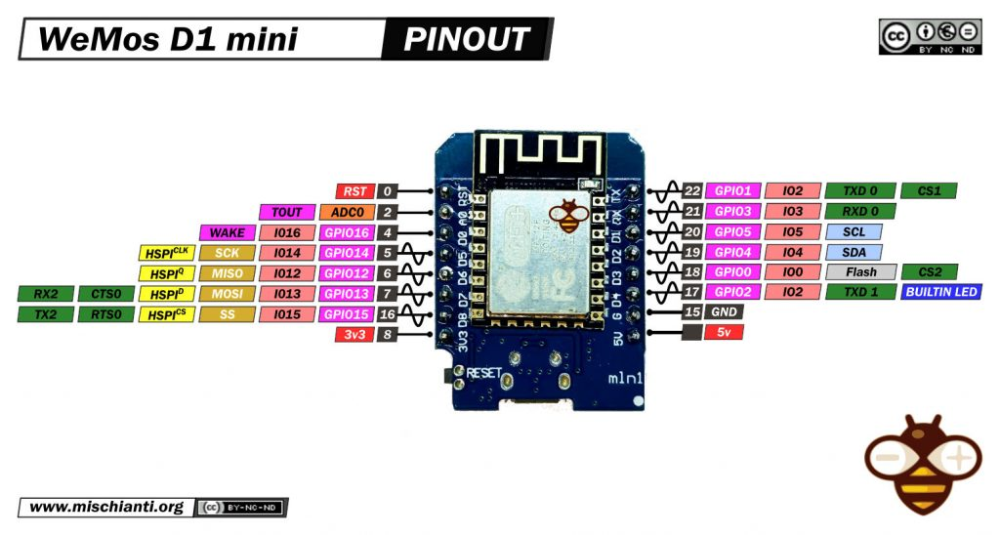

### D1 mini
* VCP driver: CH340
* LOLIN(WEMOS) D1 mini(clone)
* Pin Voltage: 3.3v
* The ESP8266 supports interrupts in any GPIO, except GPIO16.
* Pinout [More Info](https://randomnerdtutorials.com/esp8266-pinout-reference-gpios/)<br/>
</img>
* Bring down D3 or GPIO0 to enter the flash mode
### Useful link
* [Sleep](https://www.mischianti.org/2019/11/21/wemos-d1-mini-esp8266-the-three-type-of-sleep-mode-to-manage-energy-savings-part-4/)
### GPIO IRQ
* Interrupt reference
* Want to use GPIO0? No need to pull up this pin. Please catch falling event
* Want to use GPIO4? Need to pull this pin up with a 1k resistor. Catch falling event
* I don't need GPIO1/3 but they can INT. No pulling up. Catch falling event.
```
--------------------------- 
Pin        Need     Trigger 
GPIO       Pull
--------------------------- 
0(D3)       No      Falling
2(D4)       No      Falling 
4           Up      Falling 
5           Up      Falling 
12          Up      Falling 
13          Up      Falling 
14          Up      Falling 
15          No      Rising  
16               Unable to INT   
---------------------------- 
