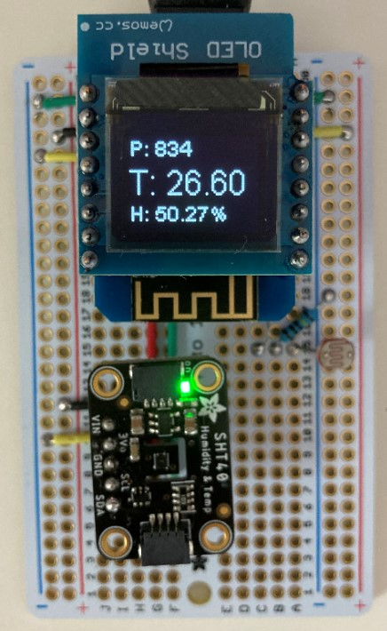

### Smart Home Project
* I have a smart light bulb and smart plug. 
* There is an air conditioner on the plug.
* I want to automate their on/offs.
  * If it is too dark, turn on the light.
  * If it is too hot, turn AC on.
### Material
* SHT40 sensor
* Photoresistor
* D1 mini OLED (optional)
* TP-Link LB120 (smart light bulb)
* TP-Link HS105 (smart plug and air conditioner)
* LOLIN D1 mini
* Linux workstation
### Plot
* D1 Mini reports temperature and luminous intensity to a linux workstation. 
* The workstation logs data and makes decision. 
* If it is too dark and the LB120 is off, turn on the light.
* If it is too hot and the HS105 is off, turn on the air conditioner.
### Code
* [C for D1 mini](hub/hub.ino)
* [Python for Linux workstation](hub.ipynb)
### D1 mini in action
</img>
