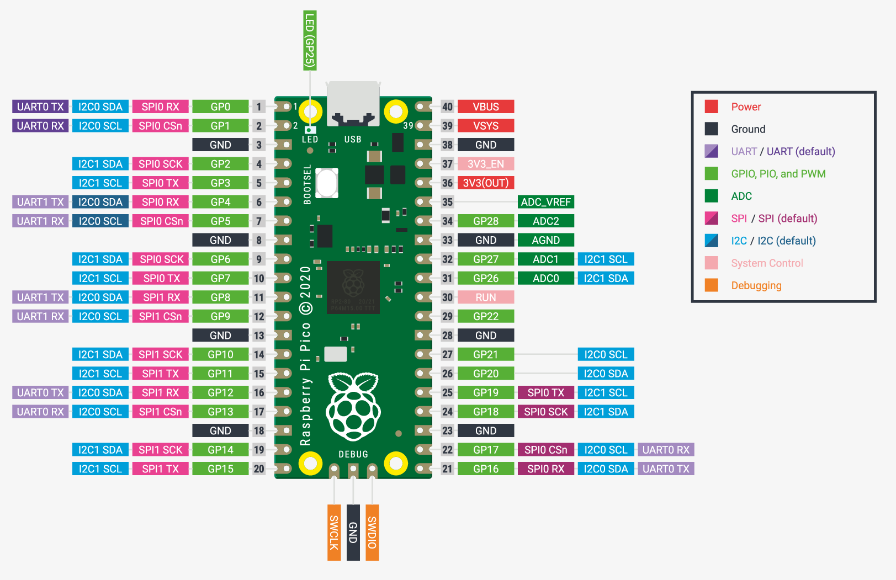

### Pin
```
GPIO   : 3.3V
3V3    : 300mA max current draw.
VBUS   : 5V Micro-USB input 
VSYS   : 1.8~5.5V input for on-board transformer(SMPS)  
GPIO25 : On-board LED
3V3_EN : Pulled-up to VSYS via a 100K resistor. 
         Disable VSYS input by pull this pin down. 
         In other words, transformer (Pico) will not work if this pin connected to GND. 
```
### Electronics
* Dual-core cortex M0+ at up to 133MHz (On-board [PLL](https://www.embedded.com/demystifying-phase-locked-loops/) can be asked to vary the clock frequency)
* 2MByte Flash
* 264kByte SRAM 
### Pinout
</img>
