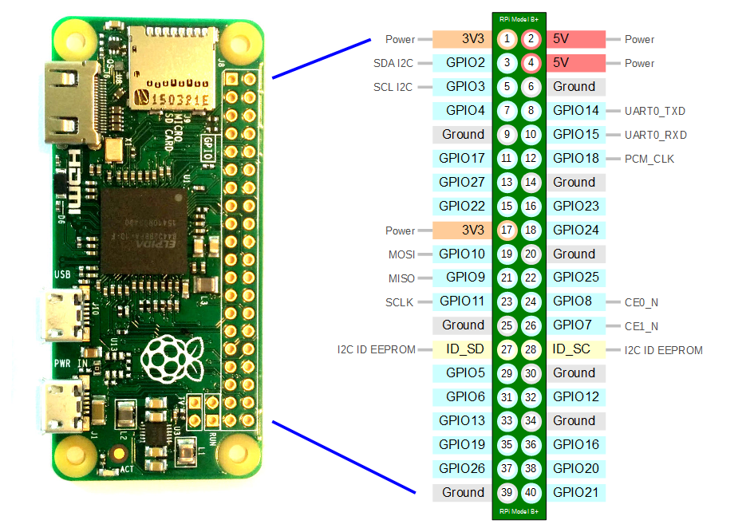

## Raspberry Pi ZW(Zero Wireless)/3A/3B/4A
* All the same across boards</br>
* GPIO pins operated at 3.3V
### Setup 

<details> 
         
  <summary> <b> As a router </b> </summary>
  
  ```
  echo "1" | sudo tee /proc/sys/net/ipv4/ip_forward
  sudo ip addr add 192.168.3.3/24 dev eth0
  sudo ip link set eth0 down
  sudo ip link set eth0 up 
  sudo iptables -t nat -A POSTROUTING -s 192.168.3.0/24 -o wlan0 -j MASQUERADE 
  ```
</details>  

<details> 
         
  <summary> <b> Clone Raspberry Pi SD card </b> </summary>
  
  ```
  dd if=/dev/sdx | pv | gzip > piOS.img.gz 
  gzip -dc piOS.img.gz | dd of=/dev/sdx
  eject /dev/sdx
  ```
</details>  

<details> 
         
  <summary> <b> How to use Two Wireless Interfaces (When I Bought a WiFi Dongle) </b> </summary>
  
  * I bought a pi-compatible WiFi dongle but how to use it?
  * wpa_supplicant ? Not so easy.
  * We will prepare two config files
  ```
  tee /etc/wpa_supplicant/wpa_supplicant.0.conf << EOF > /dev/null 
  ctrl_interface=DIR=/var/run/wpa_supplicant GROUP=netdev
  country=US
  update_config=1
  network={
      ssid="oneWiFi"
      psk="password"
      key_mgmt=WPA-PSK
  }
  EOF
  ```
  ```
  tee /etc/wpa_supplicant/wpa_supplicant.1.conf << EOF > /dev/null 
  ctrl_interface=DIR=/var/run/wpa_supplicant GROUP=netdev
  country=US
  update_config=1
  network={
      ssid="anotherWiFi"
      psk="password"
      key_mgmt=WPA-PSK
  }
  EOF
  ```
  ```
  tee /etc/network/interfaces.d/wlan << EOF > /dev/null  
  auto lo wlan0 wlan1
  iface lo inet loopback
  
  iface wlan0 inet manual
      pre-up wpa_supplicant -B -Dwext -i wlan0 -c /etc/wpa_supplicant/wpa_supplicant.0.conf
      post-down killall -q wpa_supplicant
  
  iface wlan1 inet manual
      pre-up wpa_supplicant -B -Dwext -i wlan1 -c /etc/wpa_supplicant/wpa_supplicant.1.conf
      post-down killall -q wpa_supplicant
  EOF
  ```
</details>  

<details> 
         
  <summary> <b> Set a static ip for the wired interface </b> </summary>
    
  ```
  cat << EOF >> /etc/dhcpcd.conf # This is config file for dhcp client 
  interface eth0
  static ip_address=192.168.3.3/24
  static routers=192.168.3.0
  EOF
  ```
</details>  
   
  <details> 
   
  <summary> <b> Home WiFi </b> </summary>
         
1. Download the Operating System "[Raspbian](https://downloads.raspberrypi.org/raspbian_latest)" 
2.  Write the img or iso of Raspbian to an empty 8GB+ Micro SD card. 
     * On Windows: https://rufus.ie/ 
     * Using dd in Linux: 
```
  umount /dev/sda1 # umount TF card
  dd bs=4M if=2018-11-13-raspbian-stretch.img of=/dev/sdX conv=fsync
```
3. A new partition named "Boot" appeared after the Raspbian was written to the Micro SD card. 
4. Configure SSH and WIFI so the SBC (single-board computer) could be accessed remotely few minites after booting up. 
    * Create an empty file named "ssh" in boot partition
    * Create a file named "wpa_supplicant.conf" and the content should be like
```shell
  ctrl_interface=DIR=/var/run/wpa_supplicant GROUP=netdev
  network={
      ssid="YOUR_SSID"
      psk="YOUR_WIFI_PASSWORD"
      key_mgmt=WPA-PSK
  }
``` 
  Caution: The 'NewLine Character' in wpa_supplicant.conf should follow Unix convention. 
</details> 
         
  <details>
  <summary> <b> Enterprise Network like NYU-EDU </b></summary>
           
Thanks to [Baris Unver](https://www.bunver.com/connecting-raspberry-pi-to-wpa2-enterprise-wireless-network/)<br>
I have the access to NYU Wireless service, which is protected by the wpa-enterprise protocol. Here is how I configure my Raspberry Pi. <br>
Edit the /etc/wpa_supplicant/wpa_supplicant.conf and add a new network configuration <br>
```shell
ctrl_interface=DIR=/var/run/wpa_supplicant GROUP=netdev
update_config=1
country=US

network={
    ssid="nyu-legacy"
    scan_ssid=1
    key_mgmt=WPA-EAP
    group=CCMP TKIP
    eap=PEAP
    identity="NYUNetID"
    password="NetID_Password"
    phase1="peapver=0"
    phase2="MSCHAPV2"
}
```
Then create a new file as /etc/network/interfaces.d/nyu, whose content is:<br>
```shell
auto lo
iface lo inet loopback
iface eth0 inet manual

allow-hotplug wlan0
iface wlan0 inet manual
    pre-up wpa_supplicant -B -Dwext -i wlan0 -c /etc/wpa_supplicant/wpa_supplicant.conf
    post-down killall -q wpa_supplicant
``` 
</details> 

  <details>
  <summary> <b> Modify Raspbian image on Ubuntu    </b></summary>
  
  * Download a Raspbian OS image
  ```
  img=2022-09-06-raspios-bullseye-armhf-lite.img
  xz -dk $img.xz
  ```  
  * Get offset 
    * startsector of boot partition begins at 8192
    * offset is 8192 * 512 byte/sector
  ```
$ fdisk -l $img
Disk 2022-09-06-raspios-bullseye-armhf-lite.img: 1.75 GiB, 1874853888 bytes, 3661824 sectors
Units: sectors of 1 * 512 = 512 bytes
Sector size (logical/physical): 512 bytes / 512 bytes
I/O size (minimum/optimal): 512 bytes / 512 bytes
Disklabel type: dos
Disk identifier: 0xac1488a6

Device                                      Boot  Start     End Sectors  Size Id Type
2022-09-06-raspios-bullseye-armhf-lite.img1        8192  532479  524288  256M  c W95 FAT32 (LBA)
2022-09-06-raspios-bullseye-armhf-lite.img2      532480 3661823 3129344  1.5G 83 Linux
  ```
  * Mount boot partition (First partition is FAT32 and it support uid when mount)
  ```
  mkdir /tmp/raspbian_os_boot
  sudo mount -o offset=$((8192*512)),umask=0002,uid=$UID $img /tmp/raspbian_os_boot 
  ```
  * Add / Change files 
  ```
  touch        /tmp/raspbian_os_boot/ssh                  # Enable ssh server at first boot    
  cat << EOF > /tmp/raspbian_os_boot/wpa_supplicant.conf  # Join WiFi network
  ctrl_interface=DIR=/var/run/wpa_supplicant GROUP=netdev
  country=US
  update_config=1
  network={
      ssid="YOUR_SSID"
      psk="YOUR_WIFI_PASSWORD"
      key_mgmt=WPA-PSK
  }
  EOF
  umount /tmp/raspbian_os_boot
  ```
  * Mount system partition (Second partition is EXT4 format)
  ```
  mkdir /tmp/raspbian_os_sys
  sudo mount -o offset=$((532480*512)) $img /tmp/raspbian_os_sys/
  mkdir -p                                        /tmp/raspbian_os_sys/home/pi/.ssh
  ssh-keygen -t rsa -b 4096 -N '' -C '' -f        /tmp/raspbian_os_sys/home/pi/.ssh/id_rsa
  cp /tmp/raspbian_os_sys/home/pi/.ssh/id_rsa.pub /tmp/raspbian_os_sys/home/pi/.ssh/authorized_keys
  chown -R 1000:1000                              /tmp/raspbian_os_sys/home/pi/.ssh/
  umount                                          /tmp/raspbian_os_sys/
  ```
  * Umount then the modified image can be write to SD card. 
</details>
 
  <details>
  <summary> <b> Remote deployment </b></summary>
  
  * Modify a Raspbian OS image so after written to sd card:
    * It starts a SSH server
    * It connects to a remote wireless network
    * It sshs to a jump host
    * We log into the SSH server via jump host 
  * How to  
    * Create a ssh file in /boot partition
    * Create a wpa_supplicant.conf file in /boot partition
    * Create ssh key pair for the Raspbian image
    * Add a cron job 
</details> 

### Pinout
</img>
## Raspberry Pi Pico
### Pin
```
GPIO   : 3.3V
3V3    : 300mA max current draw.
VBUS   : 5V Micro-USB input
VSYS   : 1.8~5.5V input for on-board transformer(SMPS)
GPIO25 : On-board LED
3V3_EN : Pulled-up to VSYS via a 100K resistor.
         Disable VSYS input by pull this pin down.
         In other words, transformer (Pico) will not work if this pin connected to GND.
SPI RX : MISO
SPI TX : MOSI
```
### Electronics
* Dual-core cortex M0+ at up to 133MHz (On-board [PLL](https://www.embedded.com/demystifying-phase-locked-loops/) can be asked to vary the clock frequency)
* 2MByte Flash
* 264kByte SRAM
### Pinout
* SPIx_TX = MOSI
* SPIx_RX = MISO
</img>
