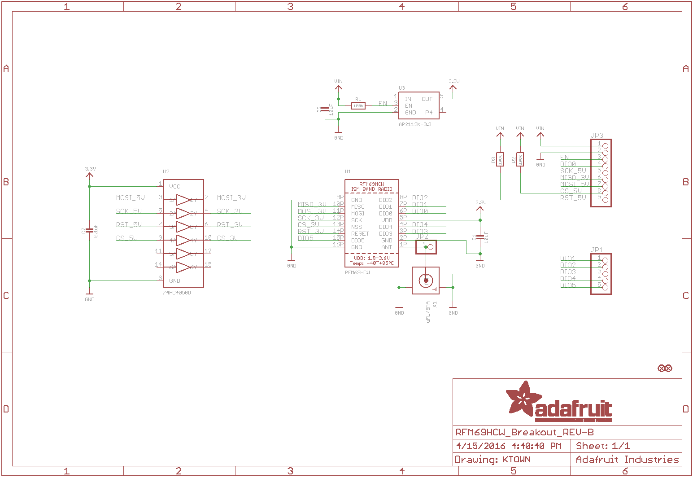

### RFM95W 
* SX1276 LoRa based module with 3.3V SPI interface
* Up tp 100 mW Power Output Capability
### Pinout
* To use [RadioLib](https://github.com/jgromes/RadioLib), have to checkout the scheme to know wich pin mapping between the module and SX1276
* DIO0 -> G0. IRQ, interrupt request. 3.3V.<br/>
</img>
*  VIN: 3.3~6VDC in. ensure 150mA current to Tx
*   EN: Pull down the enable pin to DISABLE the module
* G0\~5:DIO0\~5
### Wiring
```
RFM95W     WeMos_D1_mini 
    G0 <-> D2
   SCK <-> D5
  MISO <-> D6
  MOSI <-> D7
    CS <-> D8
   RST <-> D1         
```
### Coding with Radiolib 
* [Tx example](RFM95W/RFM95W.ino)
