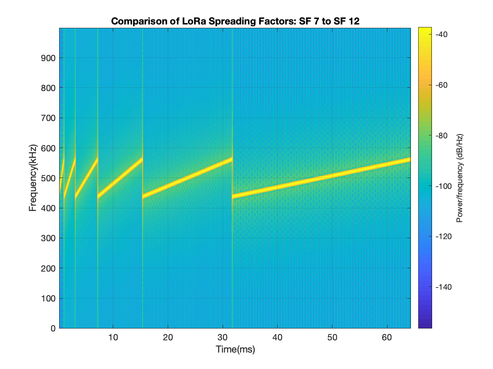
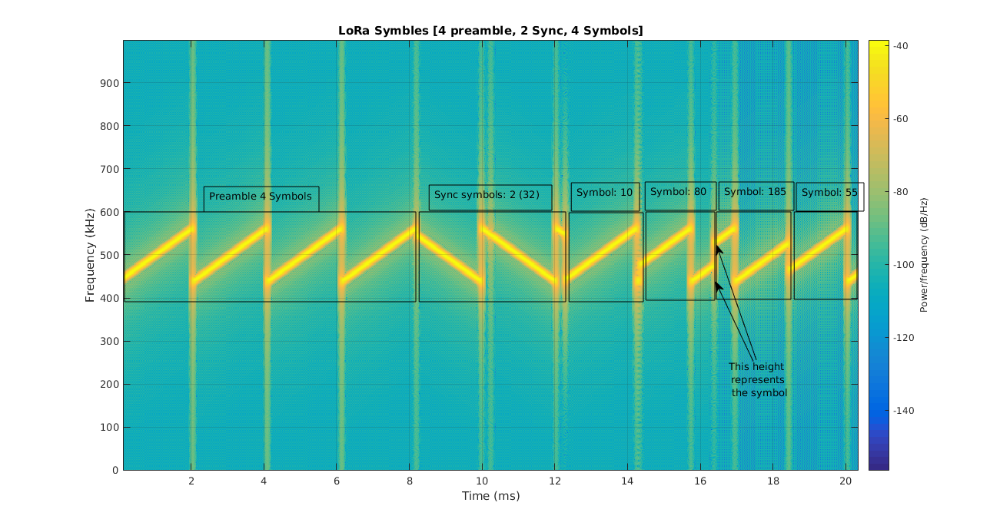

### Theory 
* LoRa: Long Range communication
 </img>(image [credit](https://doi.org/10.3390/su11071917))
* A practical analog singal is typically not pure in frequency. For example, our voice is a combination of sine waves. If we do a fourier transform, we will see a broad frequency specturm. If our voice undergoes the frequency modulation, the modulated signal will produce a frequency specturm as well. 
* Freq specturm is a 2D plot can be ploted like a vertical line in above waterfall. The color stands for Y-axis of the 2D plot.
* When we send out a message, it is digitally coded by our microprocessor/microcontroller in a sequence of 0 and 1. The frequency of this bi-state sequence is fixed. This sequence then goes through LoRa module, where it undergoes frequency modulation and a modulated analog signal leaves transmitter antenna. This modulated signal varies in frequency (see the yellow line between 15~32s in above waterfall). The signal spreads across frequency domain. The frequency of <i>frequency varying</i> is determined by the Spreading Factor (different SF, different yellow lines).
  * Symbol: Representated by one frequency varying cycle (15~32s in above waterfall) of specific pattern (yellow line). 
    * Different varying pattern stands for different symbol (see the different symbols 80 and 185 in below waterfall)
    * Different pattern leads to different end freq for one varying cycle.
    * End frequency is meaningful if other feature of the signal is same.  
  * Spreading Factor: LoRa use CSS (Chirp Spread Spectrum) tech to modulate the digital signal.
    * Larger SF means prolonged frequency varying cycle (above waterfall)  
  * Bandwidth: Varying range of modulated signal on frequency domain. (Bandwidth is about 125kHz for above yellow lines). 
    * Large bandwidth equals more varying patterns. 
  * Coding Rate: Code Rate is the degree of redundancy implemented by the forward error correction (FEC)
used to detect errors and correct them
  * Preamble: The modulated signal begins with repeated wave pattern (0~8s in below waterfall). 
 </img>(image [credit](http://www.sghoslya.com/p/lora_9.html))
### Purchasable Module by interface
* UART:
  * E32-433T30D from EByte
  * RYLR896 from REYAX
* SPI:
  * RFM95W from adafruit
* Comment:
  * One may like UART interface LoRa modules because the transmission is transparent. But their manufacturer may not want you to control the module to the maximum extent. For example, we do not know the spreading factor of E32-915T30D (Not mentioned on manual. No command to set it). E32-915T30D is SX1276-based but I cannot coordinate it with other manufacturer's SX1276-based LoRa product. Also cannot coordinate RYLR896 with other LoRa.
  * SPI interface LoRa is hard to code but more flexible. I managed to program RFM95W breakout and use it to talk to LoRa module on T-Beam.
  * Once learned how to use SPI-interface LoRa Module, I realize other LoRa development board merely bundle it on board and also use SPI interface. This is true for [Heltec WiFi LoRa 32 (V2)](../../Board/Espressif/ESP32/WIFI_LoRa_32) or [TTGO T-Beam](../../Board/Espressif/ESP32/T-Beam)
