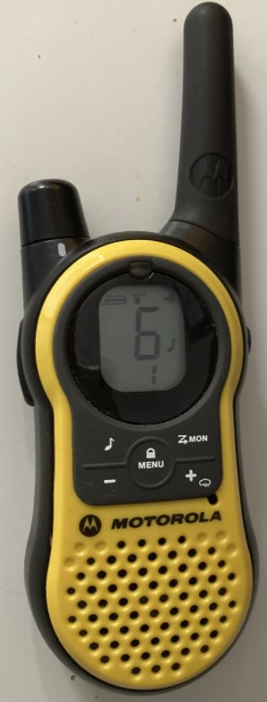

## Summary
* Listen to MH230R with RTL-SDR.
   * Assume knowing how to listen FM Radio with RTL-SDR
   * What is MH230R
   * Which band does it use. 
   * Software reconfiguration
* Play short music clip to MH230R with Yard Stick One
### Listen to MH230R with RTL-SDR
#### MH230R 
* Motorola Two-way walkie talkie MH230R 
* Operate on GMRS/FRS(General Mobile Radio Service/Family Radio Service) band. 
* Change its channel to 6 (462.6875 MHz)<br>
</img> 
#### GMRS/FRS band
* General Mobile Radio Service/Family Radio Service) band
```
#CH   Freq (MHz)      #CH   Freq (MHz)      #CH   Freq (MHz)      #CH   Freq (MHz)      #CH   Freq (MHz) 
1     462.5625        6     462.6875        11    467.6375        16    462.5750        21    462.7000
2     462.5875        7     462.7125        12    467.6625        17    462.6000        22    462.7250
3     462.6125        8     467.5625        13    467.6875        18    462.6250 
4     462.6375        9     467.5875        14    467.7125        19    462.6500 
5     462.6625        10    467.6125        15    462.5500        20    462.6750 
```
#### Gqrx reconfiguration
* Use mouse wheel to tune hardware frequency to 462.6875 MHz 
* Select Narrow FM mode 
* Start listen and use walkie talkie to talk
