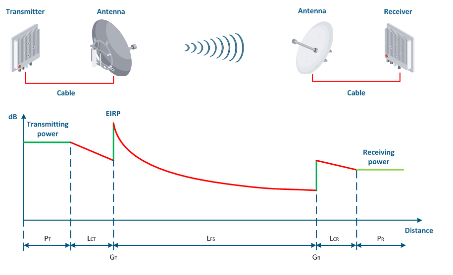

### How radio wave transmit
* Electromagnetic radiation pattern<br/>
[](https://youtu.be/FWCN_uI5ygY "EM")
### How is band devided 
* Electromagnetic spectrum 
```
        |  HF  |  VHF  |   UHF   |   SHF  |
f(MHz)  3     30      300       3k       30k
λ(m)   100    10       1        0.1      0.01
``` 
### Terminology
* FM: Frequency Modulation (Analog Modulation) -- Modulate the frequency of carrier wave according to the amplitude of singal wave. 
<br/>The modulated wave looks like:<br/>
</img><br/>
Signal:  V<SUB>m</SUB>(t) <br/>
Carrier:  V<SUB>c</SUB>(t) = V<SUB>co</SUB> sin ( 2 π f <SUB>c</SUB> t + ϕ ) <br/>
FM:  V<SUB>FM</SUB> (t) = V<SUB>co</SUB> sin (2 π [f <SUB>c</SUB> + (Δf/V<SUB>mo</SUB>) V<SUB>m</SUB> (t) ] t + ϕ) <br/>
* dBm: power strength of RF wave, 10dBm = 10^(10/10) = 10mW; 30dBm = 10^(30/10) = 1000mW  
* FSK: Frequency-Shift Keying (Digital Modulation) -- Modulate the frequency of carrier wave according the level of digital signal. 
<br/>The modulated wave looks like:<br/>
</img> 
* RG: Radio Guide (Coaxial Cable)
  * RG-174/U: 174 is type number; U stands for Universal/All-purposes. This type is popular for GPS / WLAN / UHF signal
* AWG: American Wire Gauge
  * 26 AWG: 26 is the Gauge number; Higher number, smaller diameter of wire. 26 AWG = 0.405mm. 0.1339Ω/m for copper wire. 
* RF Connector:
  * MHF or U.FL: appears on my M.2 wireless NIC
  * MHF4: appears on GPS breakout
  * RP-SMA: reverse-polarity SubMiniature version A  
* Link Budget: How the energy of EM Wave dissipates during the transmition
  * <br/>
  * [Image Credit](https://academy.infinetwireless.com/en/online-education/wireless-networking-fundamentals/8)
</img>