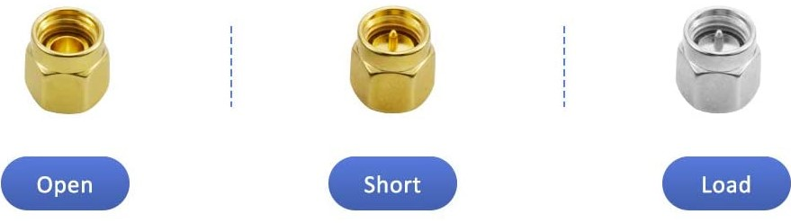

#### Vector network analyzer [[Amazon](https://www.amazon.com/gp/product/B07T6LXNTV)] 
* NanoVNA body [[Docu](http://nanovna.com/)]
* Calibration Kit: OPEN | SHORT | 50Ω LOAD  
</img>
* SMA Female to Female Through Connector
* SMA Male to Male cable x 2  
##### Measure SWR
* Brief summary: 1. Connect CH0; 2. Calibrate -> Reset -> Calibrate -> (Screw Open cap) Open -> (Screw Short cap) Short -> (Screw Load cap) Load -> (Keep load cap on) Isoln -> Thru -> Done  

##### Measure Coax Loss

