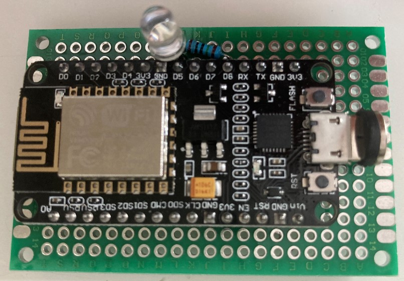

### WiFi2IR_Remote
* Use WiFi development board and Inferred LED to control projector.
* Decode ir signal with the board 
* Setup a http server with the board
* Server receive command then send it to projector.
### Hardware
* Receiver VS1838B
* Inferred LED
* 150Ω resistor
* ESP8266 WiFi SOC
### Decode IR signal from projector remote
* [Here](https://github.com/xg590/IoT/blob/master/Infrared/README.md#use-receiver-vs1838bamazon-to-decode-remote-signal) are the wiring scheme and code. 
* From Arduino serial monitor, we have following result:
``` 
20:25:00.723 -> Protocol=7 Address=0xF483 Command=0x17 Raw=0xE817F483 
```
It means the projector remote use NEC protocol send command 0x17 to address 0xF483. This command tell projector to power off. We can clone the ir signal and use an ir led to control projector
### Send cloned IR signal to projector.
* [Here](https://github.com/xg590/IoT/blob/master/Infrared/README.md#sender) is the wiring scheme 
</img> 
* [wifi_remote.ino](wifi_remote.ino) is the code 
* As the code runs on WiFi Soc, a http server runs on WLAN.
* Use GET method to tell WiFi Soc what command we want it to send.
```
import requests 
requests.get('http://192.168.0.108/irled?cmd=22&delay=5') # Home 
```
### Command explanation 
After we decoded one ir signal, we know the command is 0x17. It is a hex. How do we send 0x17 over http to the board? We convert the hex (0x17) to decimal (23) before http request, then cast the string "23" back to integer 23 after http.
```
Button      Hex      Dec
Power       0x17     23
Home        0x16     22
Up          0xb      11
Left        0xe      14
OK          0x15     21
Right       0xf      15
Settings    0x30     48
Down        0xc      12
Back        0x28     40
Vol-        0x83     131
Mute        0x14     20
Vol+        0x82     130
```
