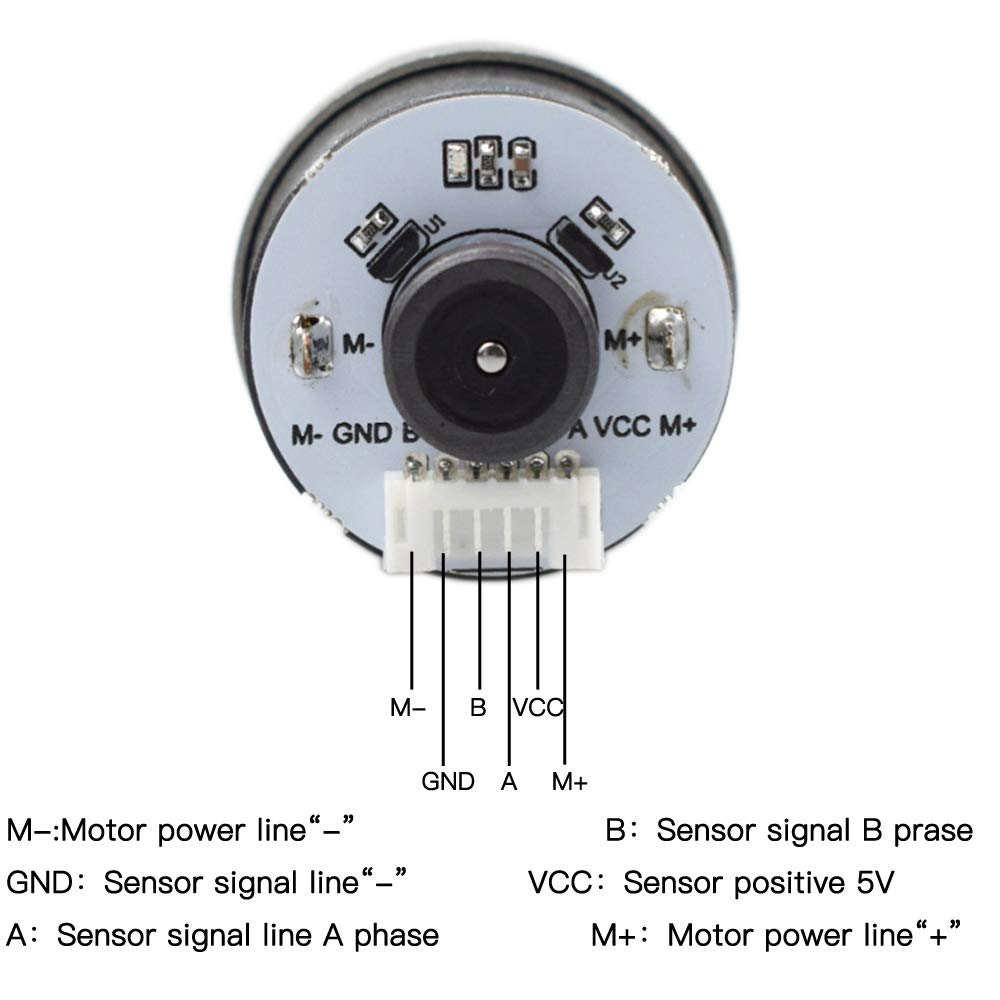
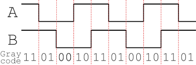

### Hall Effect Based
#### Hardware
* Encoder ([Amazon](https://www.amazon.com/dp/B07RTN8F58/))
  * Type: AB bidirectional incremental magnetic Hall encoder
  * Line speed: 12 pulse per revolution)
  * Supply voltage: DC3.3/5V
  * Basic function: comes with pull-up shaping resistor, direct connection of single chip microcomputer
  * Interface type: PH2.0 with connecting cable
  * Output signal type: square wave AB phase
  * Response frequency: 100KH
  * Magnetic ring trigger series: 24 poles (12 pairs poles)
</br></img>
#### Waveform
</br></img>
#### Coding for [MicroPython](../../Misc/MicroPython/driver/rotary.py) on Raspberry Pi Pico
* We use 2 independent events [Rising A, Rising B] and 4 pin states [High A, Low A, High B, Low B]
     * MicroPython identifies rising event as 8
     * Obviously, high pin state is 1 and low is 0
     * Since we have two pins, we can right-shift the second pin's event identifier to 4
     * When two sets of identifiers combine, we have [8, 5, 9, 4]
       * Rising A and High B can be combined together, the new combined identifier is 9
         * Rising  A, Low or High B =  8        or 9
         * Rising  B, Low or High B =  4 (8>>1) or 5 ((8>>1)+1)
       * But Rising A and Low A cannot be together
   * Look at the waveform, we will only encounter combined event [8, 5] when rotates clockwisely or encounter [9, 4] when counter-clockwisely
   * Combined event 9 will not follow 8, only 5 follows 8. Otherwise, rotation direction reversesing happens
     * We now have a EED (Event Expectation Dict) and ERR [ERRor dict]
     ```
       EED = {8:5, 5:8, 9:4, 4:9} # Expectation
       ERR = {8:5, 5:5, 9:9, 4:9} # when direction reversed, we need reset OldEvent to a default value
       if NewEvent == EED[OldEvent]:  # New event is as expected
           if   NewEvent ==  8: print('CW')
           elif NewEvent ==  4: print('CCW')
           OldEvent = NewEvent
       else:                         # New event is unexpected, reset beginning event
           OldEvent = ERR[NewEvent]  # We update old event because NewEvent could be 9 while OldEvent is 5
     ```
