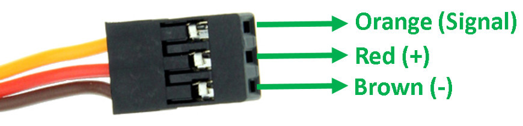

### Pins
</img>
### MG965
* Operating voltage: 4.8~ 6.6v
Gear Type: Metal gear
Temperature range: 0- 55deg
Servo Plug: JR (Fits JR and Futaba)
Dead band width: 1us
Servo wire length: 32cm
Current draw at idle 10mA
No load operating current draw 170mA
Stall current draw 1400mA
### Arduino drives SG90
```
#include <Servo.h>

const int servo_pin = 2;
int pos = 0;       // variable to store the servo position
Servo myServo;  // create servo object to control a servo

void moveToAngle(int angle) {
  if (angle > pos) {
    for (pos = 0; pos <= angle; pos += 1) myServo.write(pos);
  } else {
    for (pos = 180; pos >= angle; pos -= 1) myServo.write(pos);
  }
}

void setup(void) {
  myServo.attach(servo_pin);
}
```
### PiGPIO to drive SG90
Library
```
sudo apt install python3-pigpio
```
Start the daemon
```
sudo pigpiod -p 8889
```
Python
```python
import pigpio
pi = pigpio.pi(port=8889) ### Start PiGPIO Client
pi.set_servo_pulsewidth(26, 0)

def startGPIOdaemon():
    sock = socket.socket(socket.AF_INET, socket.SOCK_STREAM)
    sock.settimeout(2)                                            #2 Second Timeout
    result = sock.connect_ex(('127.0.0.1', gpio_port))
    if result == 0:
        print( 'pigpiod is running' )
    else:
        !sudo pkill pigpiod
        !sudo pigpiod -p 8889 ### Start PiGPIO Server / Deamon    http://abyz.me.uk/rpi/pigpio/pigpiod.html
        print( 'pigpiod was just started' )
    sock.close()
```
### PCA9685 16-Channel 12-bit PWM/Servo Driver (See board specs on the back) 
Libraries
```
pip install adafruit-circuitpython-pca9685 adafruit-circuitpython-servokit
```
Python
```python
import time
from adafruit_servokit import ServoKit
class Servo:
    # adafruit_servokit.ServoKit(*, channels, i2c=None, address=64, reference_clock_speed=25000000, frequency=50)
    kit = ServoKit(channels=16)
    servo_map = {'clamp_rot':1}

    kit.servo[servo_map['arm_ele_near']].set_pulse_width_range(800,2195) # (800, 2695)
    kit.servo[servo_map['arm_ele_near']].actuation_range = 1000

    def __setattr__(self, name, new_value):
        old_value = self.__getattribute__(name)
        self.__dict__[name] = new_value
        step = 1 if new_value>old_value else -1
        for i in range(old_value, new_value,step):
            self.kit.servo[self.servo_map[name]].angle = i
            time.sleep(0.001)
s = Servo()
 
s.arm_rot = 600 
s.arm_rot = 0 
```
