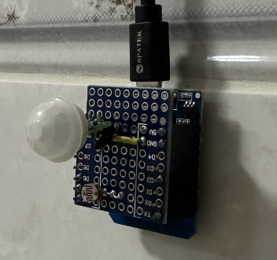
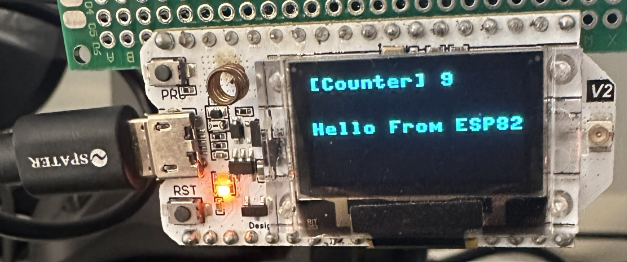
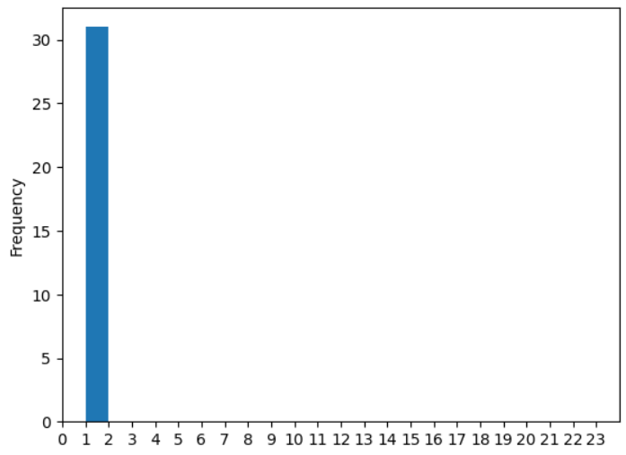

### PIR
* This is a project I want to monitor if someone is in the kitchen and how long s/he stays in the kitchen by counting the human-in-front-of-sensor. 
* I have a Raspberry Pi which serves a MQTT service, a Flask app. 
* An ESP8266 has a photoresistor, and a PIR (passive infrared sensor) sensor (AM312). It reports the luminous intensity and the existence of hot object (Human) to the Flask app on Pi.
 </img>
* The Flask put the data into a SQLite database and push a message of human-in-front-of-sensor to the "testTopic" on MQTT service. 
* An ESP32 (with OLED screen) subscribes to the "testTopic" and display the MQTT message.
 </img>
* We can visit the hist page of the Flask app to see a visualized count of the human-in-front-of-sensor. 
 </img>