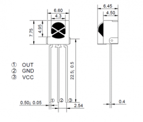

### Use receiver VS1838B([Amazon](https://www.amazon.com/gp/product/B06XYNDRGF/)) to decode remote signal
#### Receiver Specifications:
* Operating Voltage: 2.7 – 5.5vDC
* Infrared Frequency: 38kHz 1838 NEC Code
* Reception Angle: ~45 Degrees
* Reception Distance up to 18m
* Lead Pitch: 2.54mm
#### Pic

#### Wiring ([Good Ref](https://arduino.stackexchange.com/questions/3926/using-vs1838b-with-arduino))
* Resistor is not needed.
```
OUT <--> D11 (digital pin not A11/Analog Pin 11) 
GND <--> GND
VCC <--> VCC 
```
#### Code
* Library: IRremote by shirriff, z3t0, ArminJo Ver. 3.3.0
* Find protocol (NEC protocol?) enum decode_type_t in [IRProtocol.h](https://github.com/Arduino-IRremote/Arduino-IRremote/blob/master/src/IRProtocol.h)  
```C
#include <IRremote.h>
#define IR_RECEIVE_PIN 11
void setup() {
    Serial.begin(9600);
    IrReceiver.begin(IR_RECEIVE_PIN, ENABLE_LED_FEEDBACK);
    //ENABLE_LED_FEEDBACK : Blink onboard led when receive data
}

void loop() {
    if (IrReceiver.decode()) {
        if (IrReceiver.decodedIRData.protocol == UNKNOWN) {
            Serial.print("[Unknown Protocol]");
        } else {
            Serial.print("[Known Protocol] Minimal Result: ");
            IrReceiver.printIRResultMinimal(&Serial);
        }
        Serial.println();
        IrReceiver.resume(); // Enable receiving of the next value
    }
}
```
#### Sample Result  
```
20:25:00.723 -> P=7 Address=0xF483 Command=0x17 Raw=0xE817F483
```
#### ViewSonic M1 Mini Portable LED Projector
* NEC protocol
```C
IrSender.sendNECRaw(0xF00FF483, sRepeats);
Power         0xE817F483
Home          0xE916F483
Up            0xF40BF483
Left          0xF10EF483
OK            0xEA15F483
Right         0xF00FF483
Settings      0xCF30F483
Down          0xF30CF483
Back          0xD728F483
Vol-          0x7C83F483
Mute          0xEB14F483
Vol+          0x7D82F483
```
