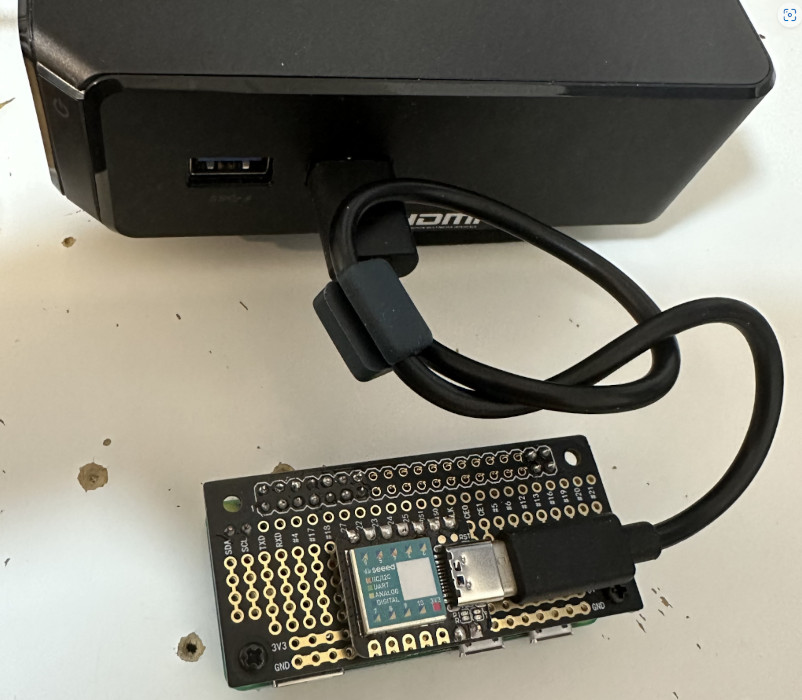

### Keyboard and Mouse Simulation
* I want control my parent's computer via the internet so I can reinstall the OS for them. 
* They do not have an IPMI-enabled motherboard, so I need to create a keyboard-mouse-over-ip device for them.
* I coupled a Seeed Studio Xiao (SAMD21) to a Raspberry Pi Zero Wireless (Pi ZW). 
  <br/></img>
  * My parents' PC will power the couple through a cable connected to Xiao and Pi will be powered through the 5V Pin.
  * The Xiao will emulate an HID Keyboard and an HID Mouse. 
  * The Pi ZW will receive command from my TCP server and forward it to Xiao via I2C. 
* Currently, I have finished to run a websocket service on Pi ZW and use Keyboard.html for remote control 
* Will start a new repo for further dev.
* Find Key_map @ ~/Arduino/libraries/Keyboard/src/Keyboard.h
* Some nonsense: USB Stack: Arduino or TinyUSB
```
arduino-cli lib install Keyboard
arduino-cli lib install Mouse
    -fqbn=Seeeduino:samd:seeed_XIAO_m0:usbstack=arduino,debug=off,sercom4=exclude  
    -fqbn=Seeeduino:samd:seeed_XIAO_m0:usbstack=tinyusb,debug=off,sercom4=exclude 
arduino-cli compile -b arduino:avr:uno --build-property build.extra_flags=-DPIN=2 --build-property "compiler.cpp.extra_flags=\"-DSSID=\"hello world\"\"" /home/user/Arduino/MySketch
                                                                                                                         "-DSSID= "hello world " "   
```