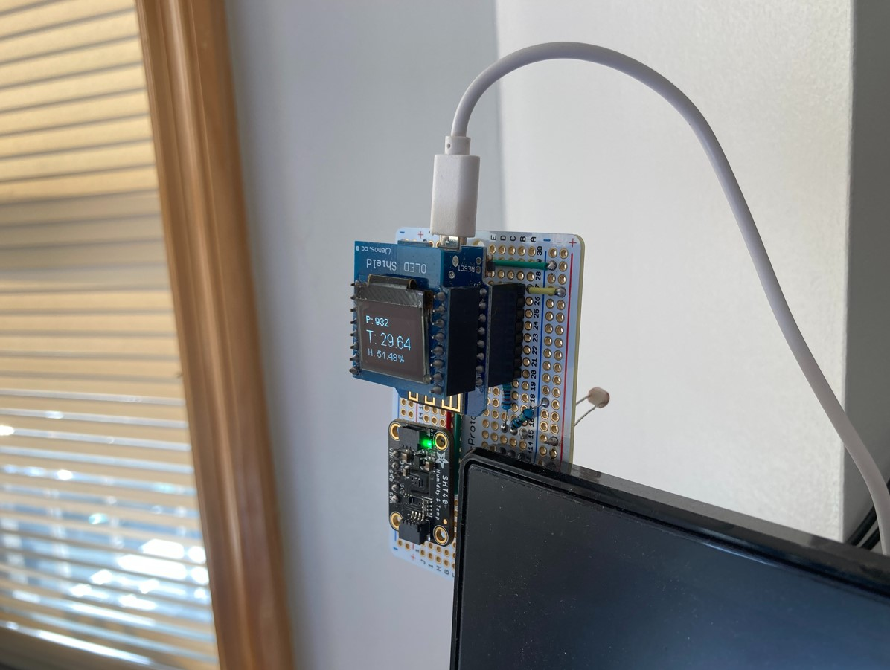
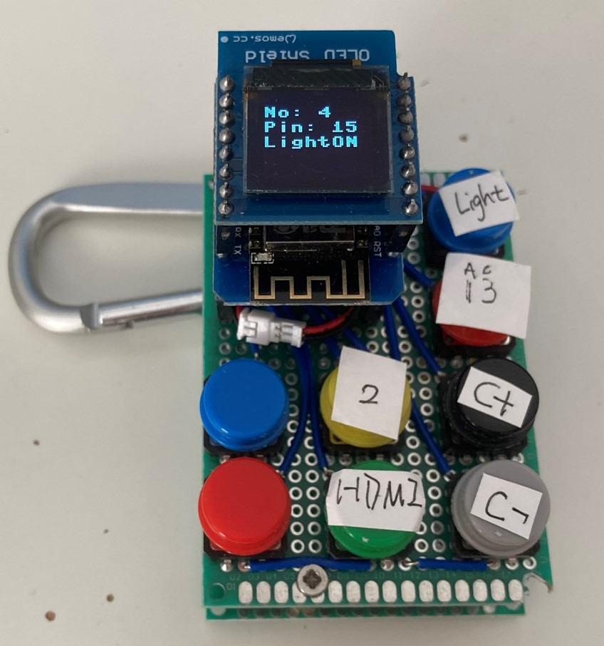
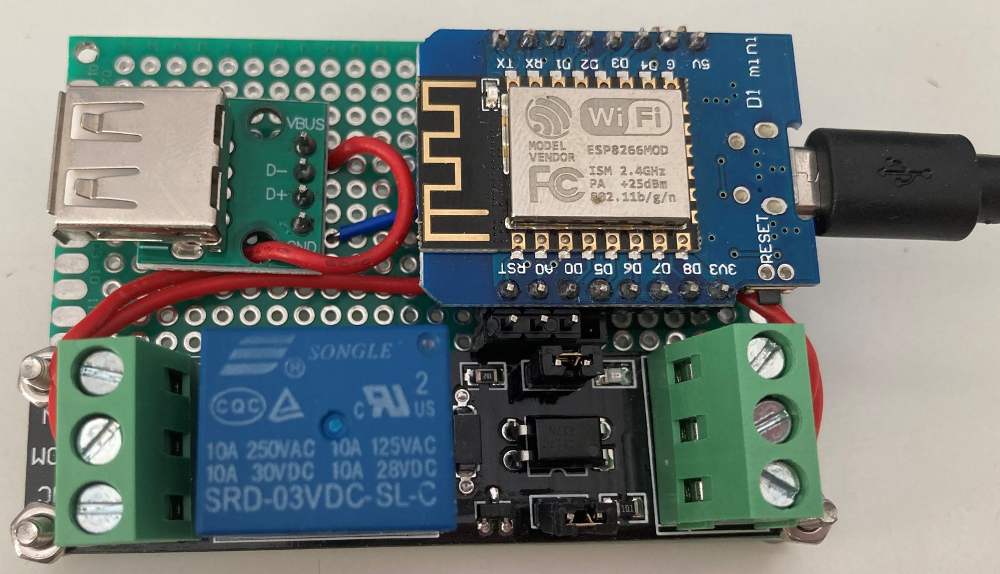

## Home Automation
### Materials
* ESP8266 + Sensors
  * D1 mini
  * Photoelectric resistor
  * SHT4x temperature/humidity sensor 
* ESP8266 Remote
  * D1 mini
  * D1 mini's oled shield, battery shiled
  * Tactile switches
* ESP8266 Relay
  * D1 mini
  * Relay
* Raspberry Pi 3B
* TP-Link HS105 WiFi-enabled power plug
* TP-Link LB110 WiFi-enabled light bulb
### Role Assignment
* Sensors report Luminance/Temperature/Humidity to a web server running on Raspberry Pi 3B
</img>
* WiFi-enabled remote asks web server to turn things on/off or tweak parameters.
</img>
* Server monitors the temperature and fetches sunrise/sunset data to turn on/off (A/C plugged) power plug and light bulb
* Bring WiFi to a relay that controlling a USB port 
</img>