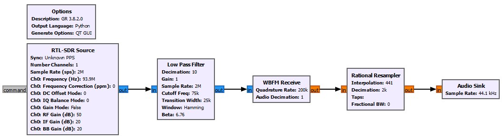
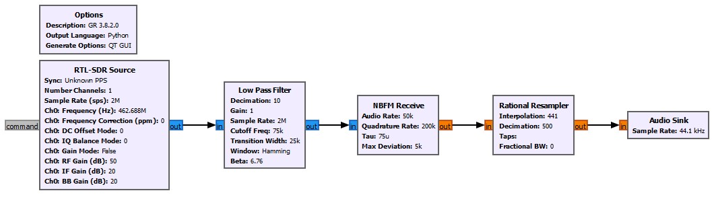

### GNU Radio 
* Works poorly in VirtualBox Virtual Machine
* I use windows version got from [here](http://www.gcndevelopment.com/gnuradio/index.htm)
### Hello World (FM radio)
* After we know how to [listen to a FM radio](../1.Listen_FM_Radio) with Gqrx SDR, we may use GNU Radio to learn what works behind the scenes 
* GNU Radio companion enable us to draw a signal processing flowchart from signal source (RTL-SDR dongle) to audio sink (sound card).
</img>
1. Get signal from RTL-SDR dongle. We are interested in freq at 93.9MHz (WNYC-FM station) and tell the dongle to sample the RF signal at 2MHz
2. Let the singal pass through a low-pass filter. We keep the filter sample rate at 2MHz but tell the filter to output a decimated singal at 200KHz (by specify the decimation number as 10).
3. A WBFM (wideband frequency modulation) receiver was used to demodulate the signal. We keep demodulating rate of Quadrature FM Demodulator at 200KHz.
4. Before we feed the demodulated signal to our audio sink (sound card), whose sample rate is 44.1KHz, we need a rational resampler to downsample the signal from 200KHz to 44.1KHz.
5. Listen to the radio.
* A Gnu Radio Companion [save file](FM_93.9MHz.grc) is avaiable for this flowchart.
### Walkie Talkie 
* Change WBFM receiver to NBFM (narrowband) receiver
* Tweak the resampler parameters   
</img>
* A Gnu Radio Companion [save file](GMRS_462.6875MHz.grc) is avaiable for this flowchart.
