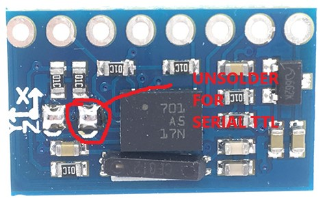

### Intro to this Experiment
* BNO055 is a system in package.
* A combination of cortex M0, microcontroller, fusion software is responsible of handling everything in the background.
* We are going to play with BNO055 from Raspberry Pi Pico by using MicroPython.
### I²C Wiring
* I2C or IIC or SMBus Pins
  * SCL: Clock line
  * SDA: Data line
```
    Slave1     Master     Slave2
    SCL    <->  SCL   <->    SCL
    SDA    <->  SDA   <->    SDA
```
### Read temperature and absolute orientation
* Following infos are from datasheet
  * The default I2C address of the BNO055 device is 0x29 (Datasheet 4.6 I2C Protocol)
  * The default operation mode after power-on is CONFIGMODE. (3.3 Operation Modes)
  * Incomplete Register Table (4.2.1 Register map Page 0)
  ```
  Page   Name              Addr    Default
   0,1   Page ID           0x07    0x00
     0   OPR_MODE          0x3D    0x1C
     0   TEMP              0x34    0x00
     0   CALIB_STAT        0x35    0x00
     0   EUL_Heading_LSB   0x1A    0x00
  ```
* Setup an i2c obj ([API doc](https://docs.micropython.org/en/latest/library/machine.I2C.html))
```
from machine import Pin, I2C
i2c = I2C(id=0, scl=Pin(5), sda=Pin(4), freq=400000)
```
* Make sure we are at Page 0 (Different page, different register)
```
>>> i2c.readfrom_mem(0x29, 0x07, 1)
b'\x00'
```
* Check if we are at CONFIGMODE
```
>>> "{0:b}".format(int.from_bytes(i2c.readfrom_mem(0x29, 0x3D, 1), 'little', True))
'10000' # 10000 is xxxx0000
```
* We read nothing in CONFIGMODE
```
>>> i2c.readfrom_mem(0x29, 0x34, 1) # TEMP
b'\x00'
```
* Change operation mode from CONFIGMODE to NDOF
```
i2c.writeto_mem(0x29, 0x3D, b'\x0C') # 0x0C == xxxx1100
```
* Read Temperature
```
>>> temp = i2c.readfrom_mem(0x29, 0x34, 1)
>>> int.from_bytes(temp, 'little', True)
31 # Celsius Deg
```
* Read Calibration Status
```
>>> "{0:b}".format(int.from_bytes(i2c.readfrom_mem(0x29, 0x35, 1), 'little', True))
'110100' # Last two zeros means magnetometer is not calibrated
```
* Shake BNO055 and what happend
```
>>> "{0:b}".format(int.from_bytes(i2c.readfrom_mem(0x29, 0x35, 1), 'little', True))
'110011' # Calibrated
```
* Read Heading
```
import time
while 1:
  print(int.from_bytes(i2c.readfrom_mem(0x29, 0x1A, 2), "little", True) / 16) # 16 is from Table 3-29: Euler angle data representation
  time.sleep(0.2)
```
### Some Soldering Work to enable I2C communication<br>
An important quote from [VitallyRaccoon's post](https://forum.arduino.cc/index.php?topic=574580.0): "To configure the module for i2c communication both jumpers should be closed."<br>

